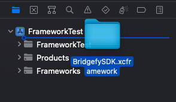
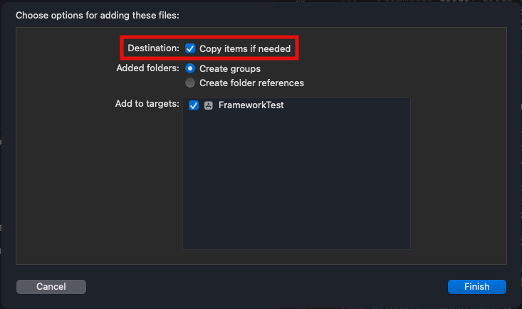
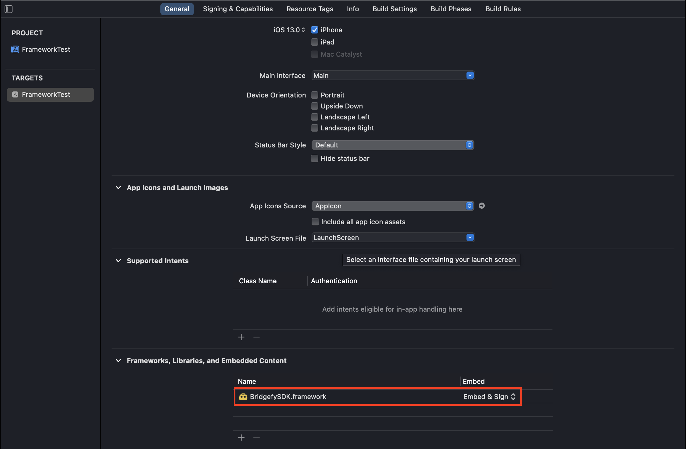
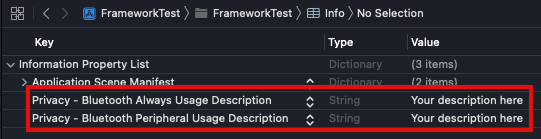

<p align="center">
    
</p>

<p align="center">
    
</p>

The Bridgefy Software Development Kit (SDK) is a state-of-the-art, plug-and-play package that will let people use your mobile app when they don’t have access to the Internet, by using Bluetooth mesh networks.

Integrate the Bridgefy SDK into your Android and iOS app to reach the 3.5 billion people that don’t always have access to an Internet connection, and watch engagement and revenue grow!

**Website**. https://bridgefy.me/sdk/ <br>
**Email**. contact@bridgefy.me <br>
**Twitter**. https://twitter.com/bridgefy <br>
**Facebook**. https://www.facebook.com/bridgefy <br>


## Overview
Bridgefy creates mesh networks in which devices connect directly to each other in a decentralized manner. This allows users to communicate with nearby devices within a certain range, forming a network without the need for a centralized server or Internet access.


The Bridgefy SDK provides a set of tools and APIs that developers can use to incorporate offline messaging, data transfer, and real-time communication features into their applications. It allows users to send data directly to other nearby devices using Bluetooth Low Energy.

### Table of contents

1. [Installation](#installation)
   - [Swift Package Manager](#swift-package-manager)
   - [Cocoapods](#cocoapods)
   - [Manually](#manually)
2. [Permissions](#permissions)
3. [Usage](#usage)
   - [Initialization](#initialization)
   - [Start](#start)
   - [Propagation Profiles](#propagation-profiles)
   - [Stop](#stop)
   - [Destroy Session](#destroy-session)
   - [Sending data](#sending-data)
   - [Receiving Data](#receiving-data)
4. [Secure connections](#secure-connections)
   - [Established secure connection](#established-secure-connection)
   - [Recommendations for using a secure connection](#recommendations-for-using-a-secure-connection)
   - [Fingerprint](#fingerprint)
5. [Supported Devices](#supported-devices)
6. [Contact & Support](#contact--support)

## Installation

### Swift Package Manager

The Swift Package Manager is a tool for managing the distribution of Swift code. It’s integrated with the Swift build system to automate the process of downloading, compiling, and linking dependencies.

1. Follow the [Apple documentation](https://developer.apple.com/documentation/xcode/adding-package-dependencies-to-your-app) on how to add a package to your project.
2. Paste the following URL, `https://github.com/bridgefy/sdk-ios`, into the Package Dependencies search bar.
3. Use the version-based Package Requirements, and set the value to the latest version of the Bridgefy SDK.

### Cocoapods

CocoaPods is a dependency manager that lets you add third-party frameworks and libraries to projects. For installation instructions, see [Install CocoaPods](https://guides.cocoapods.org/using/getting-started.html#toc_3).

Add the Bridgefy SDK to your Podfile and install it in your project as follows:

1. Add pod 'BridgefySDK' to the do block:

    ```cocoapods
    platform :ios, '13.0'

    target 'SDK test' do
    use_frameworks!

    pod 'BridgefySDK'
    end
    ```

2. Save the Podfile.
3. Run the following command in the Terminal:

    ```terminal
    $ pod install
    ```

### Manually

1. Download the `BridgefySDK.framework` from this repository.
2. Drag the `BridgefySDK.framework` folder to the top of your project's hierarchy in Xcode.

    <p align=center>
    
    </p>

3. Select `Copy items if needed` from the dialog window after releasing the folder into your project.

    <p align=center>
    
    </p>

4. In the general section of your project's target, go to the section `Frameworks, Libraries and Embedded Content`, look for the `BridgefySDK.framework`, and in the `Embed` column, select the option ***Embed & Sign***

    <p align=center>
    
    </p>

5. Import the Bridgefy SDK using the following code:

    ```swift
    import BridgefySDK
    ```

### Permissions

The BridgefySDK requires permission to use the Bluetooth antenna of the devices where it's installed; to achieve this, you have to add a couple of entries on the `Info.plist` of your project. The entries are depicted in the following image:

<p align=center>

</p>

## Usage

### Initialization

The init method initializes the Bridgefy SDK with an API key. The delegate parameter is required and should be an object that conforms to the `BridgefyDelegate` protocol. The verboseLogging parameter is optional and enables more detailed logging if set to true.

The following code shows how to start the SDK (using your API key) and how to assign the delegate.

```swift
do {
      bridgefy = try Bridgefy(withApiKey: apiKey,
                              delegate: BridgefyDelegate,
                              verboseLogging: Bool)
} catch {
    // Handle the error
}

```

The string **apiKey** represents a valid API key. An Internet connection is needed, at least for the first time to validate the license.
The **delegate** is the class that will implement all the delegate methods from the BridgefySDK.

### Start

After initializing the SDK, you should call the `start()` function to have the SDK's services running.

```swift
bridgefy.start(withUserId: UUID?,
               andPropagationProfile: PropagationProfile)
```

The optional UUID **userId** is the id that the SDK will use to identify the user. If a nil value is passed, the SDK will randomly assign a UUID.
The **propagationProfile** value is the profile the SDK will use to propagate messages through the mesh.

Once the service is started, the following delegate function is called:

```swift
func bridgefyDidStart(with userId: UUID)
```

The **userId** is the id used to identify the current user/device in the BridgefySDK.

In the case an error occurs while starting the BridgefySDK, the following delegate function is called:

```swift
func bridgefyDidFailToStart(with error: BridgefyError)
```

### Propagation Profiles

```swift
enum PropagationProfile {
    case standard
    case highDensityNetwork
    case sparseNetwork
    case longReach
    case shortReach
}
```

| **Profile** | **Hops limit** | **TTL(s)** | **Sharing Time** | **Maximum Propagation** | **Tracklist limit** |
|---|---|---|---|---|---|
| Standard | 100 | 86400 (1 d) | 15000 | 200 | 50 |
| High Density Environment | 50 | 3600 (1 h) | 10000 | 50 | 50 |
| Sparse Environment | 100 | 302400 (3.5 d) | 10000 | 250 | 50 |
| Long Reach | 250 | 604800 (7 d) | 15000 | 1000 | 50 |
| Short Reach | 50 | 1800 | 10000 | 50 | 50 |

- **Hops limit:** The maximum number of hops a message can get. Each time a message is forwarded, is considered a hop.
- **TTL:** Time to live, is the maximum amount of time a message can be propagated since its creation.
- **Sharing time:** The maximum amount of time a message will be kept for forwarding.
- **Maximum propagation:** The maximum number of times a message will be forwarded from a device.
- **Tracklist limit:** The maximum number of UUID's stored in an array to prevent sending the message to a peer which already forwarded the message.

### Stop

To stop the SDK, use the following function:

```swift
  func stop()
```

After the service is stopped, the following delegate function is called:

```swift
func bridgefyDidStop()
```

### Destroy Session

Call this method when you want to terminate the current Bridgefy session and destroy all related data:

```swift
  func destroySession()
```

After the session is destroy, the following delegate function is called:

```swift
func bridgefyDidDestroySession()
```

### Nearby peer detection

The following method is invoked when a peer has established a connection:

```swift
func bridgefyDidConnect(with userId: UUID)
```

**userId**: Identifier of the user that has established a connection.

When a peer is disconnected(out of range), the following method will be invoked:

```swift
func bridgefyDidDisconnect(from userId: UUID)
```

**userId**: Identifier of the disconnected user.

### Sending data

The following method is used to send data using a transmission mode. This method returns a UUID to identify the message sent.

```swift
do {
    let messageID = try bridgefy.send(Data,
                                 using: TransmissionMode)
            
} catch {
    // Handle the error
}
```

**messageId**: Unique identifier related to the message.

If the message was successfully sent, the following delegate method is called:

```swift
func bridgefyDidSendMessage(with messageId: UUID)
```

**messageId**: The unique identifier of the message sent.

***Note:*** It Is important to notice that the call of this delegate method doesn't mean the message was delivered. This is due to the nature of how the messages travel through the mesh network created by the BridgefySDK. The ONLY scenario where you can assume that the message was delivered is when it was sent using the `p2p` transmission mode; otherwise, it only means that there's no pre-validation error, and the SDK will start propagating the message.

If an error occurs while sending a message, the following delegate method is called:

```swift
func bridgefyDidFailSendingMessage(with messageId: UUID,
                                   withError error: BridgefyError)
```

### Receiving Data

When a packet has been received, the following method will be invoked:

```swift
func bridgefyDidReceiveData(_ data: Data,
                            with messageId: UUID,
                            using transmissionMode: TransmissionMode)
```

**data**: Received data.
**messageId**: The id of the message that was received
**transmissionMode**: The transmission mode used to propagate a message

**Transmission Modes**:

```swift
public enum TransmissionMode {
    case p2p(userId: UUID)
    case mesh(userId: UUID)
    case broadcast(senderId: UUID)
}
```

The mode used to propagate a message through nearby devices:

**p2p(userId: UUID)**: Sends the message data only when the receiver is in range; otherwise an error is reported.
**mesh(userId: UUID))**: Sends the message data using the mesh created by the SDK. It doesn’t need the receiver to be in range. 
**broadcast(senderId: UUID)**: Sends a packet using mesh without a defined receiver. The packet is broadcast to all nearby users that are or aren’t in range.

### Direct and mesh transmission

Direct transmission is a mechanism used to deliver packets to a user that is nearby or visible (a connection has been detected).

Mesh transmission is a mechanism used to deliver offline packets even when the receiving user isn’t nearby or visible. It can be achieved by taking advantage of other nearby peers; these receive the package, hold it, and forward it to other peers trying to find the receiver.

## Secure connections

Part of Bridgefy's functionality is its ability to provide a secure connection for sending data within a mesh network. To ensure the privacy and security of sensitive data, Bridgefy SDK employs encryption techniques. Encryption involves transforming data into an unreadable format, which can only be deciphered by authorized recipients who possess the correct decryption key.

Bridgefy utilizes the Signal Protocol, a widely recognized and trusted encryption protocol, to encrypt sensitive data exchanged between devices in a mesh network. The Signal Protocol provides end-to-end encryption, meaning the data remains encrypted throughout its entire journey from the sender to the intended recipient. This ensures that even if someone intercepts the data, they won't be able to access its contents without the proper decryption key.

> However, companies and developers who use the Bridgefy SDK in their mobile apps also have the option to implement their own custom encryption if they prefer,
> which doesn't require the establishment of a secure connection but needs robust encryption-key management practices

### Established secure connection

Bridgefy SDK offers the option to establish secure connections within the mesh network, encrypting the data traveling on the
mesh using the Signal protocol. This ensures a secure connection and protects the data from unauthorized access.

When node is connected you can try to establishing a secure connection with follow method:

````swift
 public func establishSecureConnection(with userId: UUID) 
````
When the establishment is done, the secure connection is notified on delegate:
````swift
func bridgefyDidEstablishSecureConnection(with userId: UUID)
````

> Bridgefy also allows users to implement their own custom encryption if they prefer not to use the Signal Protocol.
> In such cases, where custom encryption is utilized, it's important to note that Bridgefy does not require the establishment of a secure connection between devices.

### Recommendations for using a secure connection

While it's common to think that a secure connection needs to be established simultaneously with other connections, it's not always the case. In fact, many secure connection protocols allow for the establishment of connections at different times, depending on the specific requirements and circumstances.

By recommending a secure connection that is not simultaneous, it means that the focus should be on establishing a secure connection whenever it is feasible and appropriate, without being bound to the constraints of synchronizing the connection with other devices.

This approach allows for flexibility and adaptability in securing the connection. For example, a device may establish a secure connection with one device at a time, ensuring that each connection is properly encrypted and authenticated. This way, the security of the connection is not compromised, even if it takes place at different times.

Additionally, requesting a secure connection that is not simultaneous can also be beneficial in terms of resource management. Establishing secure connections simultaneously with multiple devices may impose a heavier burden on the device's resources, such as processing power and network bandwidth. By prioritizing security over simultaneous connections, the device can allocate resources effectively and maintain a high level of security for each connection.

## Fingerprint

```swift
public func fingerprint(for userId: UUID) throws -> BridgefyFingerprint? 
```

This method is used to generate a fingerprint for the secure connection established with a specific user identified by their UUID. A fingerprint is a unique identifier associated with a user's secure connection. It allows users to recognize and communicate securely with each other.

```swift
public func isFingerprintValid(_ fingerprintData: Data, for userId: UUID) throws -> Bool 
```

This method is used to verify the validity of a fingerprint for a particular user identified by their UUID. It allows users to ensure that they are securely communicating with the intended recipient by validating their fingerprint.

## Supported Devices

Bridgefy's support for devices extends to smartphones and tablets, as long as they run iOS or Android, and have BLE. This makes Bridgefy a versatile platform that caters to various communication needs. By enabling connectivity across a diverse range of devices, Bridgefy ensures that users can easily establish connections and exchange information regardless of whether they have an internet connection or not.

## Contact & Support
+ contact@bridgefy.me

© 2023 Bridgefy Inc. All rights reserved
